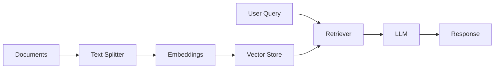

# Mastering RAG: Build Smart, Data-Driven Applications

[](https://www.python.org/downloads/)
[](https://langchain.com/)
[](https://www.ibm.com/products/watsonx-ai)
[](https://opensource.org/licenses/MIT)

## 🚀 Overview

This repository contains a comprehensive collection of Retrieval-Augmented Generation (RAG) projects that demonstrate advanced AI application development capabilities. The projects showcase expertise in building intelligent, data-driven systems that combine the power of Large Language Models (LLMs) with external knowledge sources.

## 🎯 What is RAG?

Retrieval-Augmented Generation (RAG) is a cutting-edge technique that enhances Large Language Models by integrating external data sources into their reasoning process. While LLMs excel at broad reasoning, their knowledge is limited to training data up to a specific cutoff date. RAG addresses this limitation by:

* ***Dynamic Knowledge Integration**: Retrieving relevant information and inserting it into model prompts
* **Private Data Processing**: Enabling AI to reason about proprietary or newly introduced data
* **Contextual Accuracy**: Ensuring responses are accurate, timely, and contextually relevant

## 🏗️ Architecture Overview

### Core Components

1. **Indexing Pipeline** (Offline)
   * Document loading and preprocessing
   * Text splitting and chunking
   * Vector embedding generation
   * Storage in vector databases

2. **Retrieval & Generation** (Runtime)
   * Query processing and similarity search
   * Relevant context retrieval
   * LLM prompt augmentation
   * Response generation



## 📚 Project Portfolio

### 1. 🔒 Private Document Summarization
**Status:** ✅ Complete | **Tech Stack:** RAG, LangChain, IBM watsonx.ai

A sophisticated document processing system that enables secure summarization and Q&A capabilities for private documents without external data exposure.

#### Key Features
* **Multi-Model Support**: Integration with FLAN-T5-XL and Llama 3.3-70B models
* **Intelligent Chunking**: Optimized text splitting for efficient processing
* **Conversational Memory**: Context-aware dialogue capabilities
* **Source Attribution**: Traceable responses with document references

#### Technical Implementation
```python
# Core architecture components
* Document Loader: TextLoader for file ingestion
* Text Splitter: CharacterTextSplitter with 1000-character chunks
* Embeddings: HuggingFace sentence transformers
* Vector Store: ChromaDB for efficient retrieval
* LLM Integration: IBM watsonx.ai models via LangChain
```

### 2. 🔍 Granite 3 Retrieval Agent
**Status:** 🚧 In Development | **Tech Stack:** LlamaIndex, Granite 3.0

Advanced retrieval system supporting multiple data formats (PDFs, HTML, text files) with precision-focused insights.

### 3. 🌐 Web Data RAG System
**Status:** 📋 Planned | **Tech Stack:** LangChain, Llama 3.1

Real-time web data processing and analysis system for dynamic, context-aware interactions.

### 4. 📺 YouTube Content Processor
**Status:** 📋 Planned | **Tech Stack:** FAISS, RAG, NLP

Automated video transcript extraction, summarization, and interactive Q&A system development.

### 5. 🤝 AI Icebreaker Bot
**Status:** 📋 Planned | **Tech Stack:** Granite 3.0, LlamaIndex, ProxyCurl API

LinkedIn profile analysis and personalized conversation starter generation for professional networking.

## 🛠️ Technical Stack

### Core Technologies
* **Language Models**: IBM watsonx.ai (Granite, Llama, FLAN-T5)
* **Frameworks**: LangChain, LlamaIndex
* **Vector Databases**: ChromaDB, FAISS
* **Embeddings**: HuggingFace Transformers, Sentence-BERT
* **APIs**: ProxyCurl (LinkedIn), IBM watsonx.ai

## 📄 License

This project is licensed under the MIT License - see the [LICENSE](https://creativecommons.org/licenses/by/4.0/) file for details.

## 🔗 Resources

* [IBM watsonx.ai Documentation](https://docs.anthropic.com)
* [LangChain Documentation](https://langchain.com/docs)
* [RAG Best Practices Guide](https://example.com/rag-guide)

