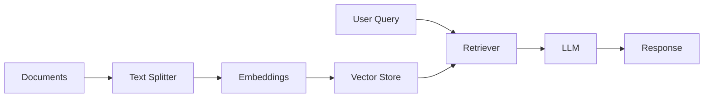
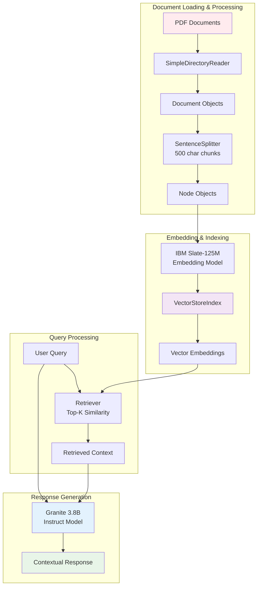
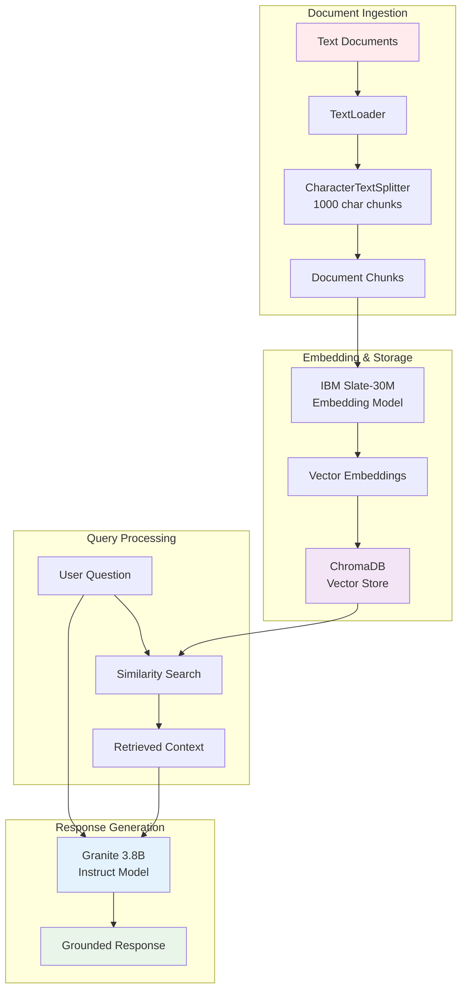
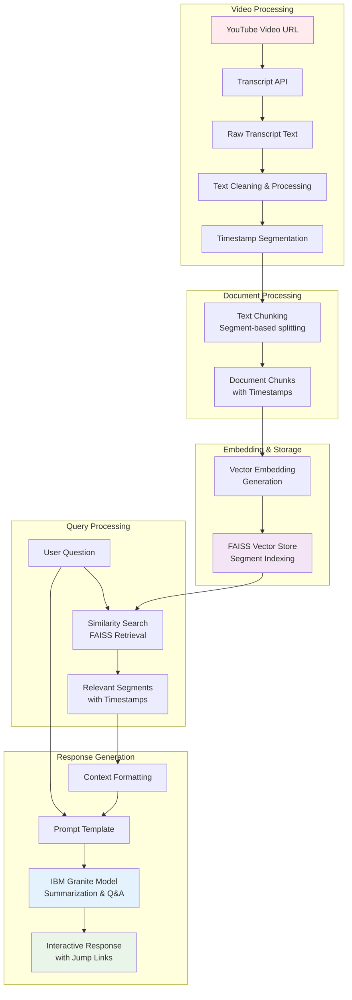
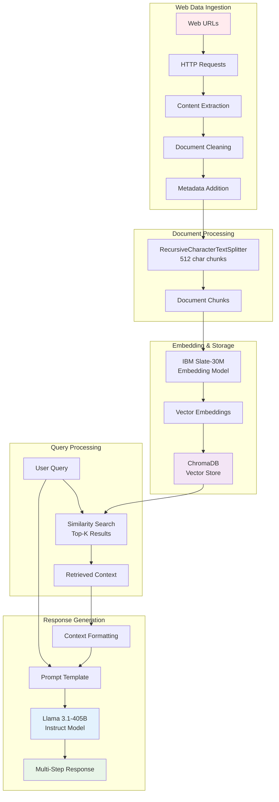

# Mastering RAG: Build Smart, Data-Driven Applications

[](https://www.python.org/downloads/)
[](https://langchain.com/)
[](https://www.ibm.com/products/watsonx-ai)
[](https://opensource.org/licenses/MIT)

## 🚀 Overview

This repository contains a comprehensive collection of Retrieval-Augmented Generation (RAG) projects that demonstrate advanced AI application development capabilities. The projects showcase expertise in building intelligent, data-driven systems that combine the power of Large Language Models (LLMs) with external knowledge sources.

## 🎯 What is RAG?

Retrieval-Augmented Generation (RAG) is a cutting-edge technique that enhances Large Language Models by integrating external data sources into their reasoning process. While LLMs excel at broad reasoning, their knowledge is limited to training data up to a specific cutoff date. RAG addresses this limitation by:

* ***Dynamic Knowledge Integration**: Retrieving relevant information and inserting it into model prompts
* **Private Data Processing**: Enabling AI to reason about proprietary or newly introduced data
* **Contextual Accuracy**: Ensuring responses are accurate, timely, and contextually relevant

## 🏗️ Architecture Overview

### Core Components

1. **Indexing Pipeline** (Offline)
   * Document loading and preprocessing
   * Text splitting and chunking
   * Vector embedding generation
   * Storage in vector databases

2. **Retrieval & Generation** (Runtime)
   * Query processing and similarity search
   * Relevant context retrieval
   * LLM prompt augmentation
   * Response generation



## 📚 Project Portfolio

### 1. 🔒 Private Document Summarization
**Status:** ✅ Complete | **Tech Stack:** RAG, LangChain, IBM watsonx.ai

A sophisticated document processing system that enables secure summarization and Q&A capabilities for private documents without external data exposure.

#### Key Features
* **Multi-Model Support**: Integration with FLAN-T5-XL and Llama 3.3-70B models
* **Intelligent Chunking**: Optimized text splitting for efficient processing
* **Conversational Memory**: Context-aware dialogue capabilities
* **Source Attribution**: Traceable responses with document references

#### Technical Implementation
```python
# Core architecture components
* Document Loader: TextLoader for file ingestion
* Text Splitter: CharacterTextSplitter with 1000-character chunks
* Embeddings: HuggingFace sentence transformers
* Vector Store: ChromaDB for efficient retrieval
* LLM Integration: IBM watsonx.ai models via LangChain
```

### 2. 🔍 Granite 3 Retrieval Agent
**Status:** 🚧 In Development | **Tech Stack:** LlamaIndex, Granite 3.0

Advanced retrieval system supporting multiple data formats (PDFs, HTML, text files) with precision-focused insights.

### 3. 🌐 Web Data RAG System
**Status:** 📋 Planned | **Tech Stack:** LangChain, Llama 3.1

Real-time web data processing and analysis system for dynamic, context-aware interactions.

### 4. 📺 YouTube Content Processor
**Status:** 📋 Planned | **Tech Stack:** FAISS, RAG, NLP

Automated video transcript extraction, summarization, and interactive Q&A system development.

### 5. 🤝 AI Icebreaker Bot
**Status:** 📋 Planned | **Tech Stack:** Granite 3.0, LlamaIndex, ProxyCurl API

LinkedIn profile analysis and personalized conversation starter generation for professional networking.

## 🛠️ Technical Stack

### Core Technologies
* **Language Models**: IBM watsonx.ai (Granite, Llama, FLAN-T5)
* **Frameworks**: LangChain, LlamaIndex
* **Vector Databases**: ChromaDB, FAISS
* **Embeddings**: HuggingFace Transformers, Sentence-BERT
* **APIs**: ProxyCurl (LinkedIn), IBM watsonx.ai

---

### Project 2. Granite 3 Retrieval Agent with LlamaIndex

An advanced RAG application using LlamaIndex framework with IBM Granite 3.0 model for precise document retrieval and expert-level query responses on scientific and technical documents.

#### Key Features
* **LlamaIndex Framework**: Complete RAG pipeline implementation using modern indexing techniques
* **Granite 3.8B Instruct Model**: IBM's latest instruction-tuned dense decoder model trained on 12 trillion tokens
* **Advanced Document Processing**: PDF processing with intelligent chunking (500-character nodes)
* **Vector Embeddings**: IBM Slate-125M English retriever for semantic understanding  
* **Precision Retrieval**: Configurable similarity search with top-k results
* **Scientific Focus**: Optimized for research papers and technical documentation
* **Interactive Query Engine**: Real-time question-answering with contextual responses
* **Multi-Language Support**: 12 natural languages and 116 programming languages

#### Technical Architecture


```python
# LlamaIndex RAG Pipeline
PDF Loading → Document Parsing → Node Splitting → Vector Embedding → Index Creation

# Core Components:
├── SimpleDirectoryReader (PDF ingestion)
├── SentenceSplitter (500-char chunking)  
├── WatsonxEmbeddings (IBM Slate-125M)
├── VectorStoreIndex (Efficient storage)
├── Query Engine (Retrieval + Generation)
└── WatsonxLLM (Granite 3.8B Instruct)
```

#### Technology Stack
* **LLM Model**: IBM Granite 3.8B Instruct (ibm/granite-3-8b-instruct)
* **Framework**: LlamaIndex 0.10.65
* **Embedding Model**: IBM Slate-125M English Retriever
* **Document Processing**: SimpleDirectoryReader, SentenceSplitter
* **Vector Store**: VectorStoreIndex with similarity search
* **Platform**: IBM watsonx.ai
* **API Integration**: llama-index-llms-ibm, llama-index-embeddings-ibm
* **Configuration**: Temperature 0.1, max_new_tokens 75, top-k retrieval

---

### Project 3. 🤖 Q&A Agent with LangChain, Granite 3, and RAG

**Status:** ✅ Complete | **Tech Stack:** LangChain, IBM watsonx.ai, Granite 3.8B, RAG, ChromaDB

A comprehensive question-answering agent that leverages IBM Granite 3.8B Instruct model with LangChain framework to create an intelligent document retrieval and response system using Retrieval-Augmented Generation (RAG) technology.

#### Key Features
* **Granite 3.8B Instruct Integration**: Utilizes IBM's latest instruction-tuned dense decoder model trained on 12+ trillion tokens
* **Advanced RAG Pipeline**: Complete retrieval-augmented generation workflow with LangChain orchestration
* **Intelligent Document Processing**: CharacterTextSplitter for optimized 1000-character chunking with zero overlap
* **Semantic Search**: IBM Slate-30M English embedding model for precise vector similarity matching
* **ChromaDB Vector Store**: Efficient storage and retrieval of document embeddings
* **Conversational Memory**: Context-aware question-answering with document grounding
* **Multi-Language Support**: 12 natural languages and 116 programming languages capability
* **Greedy Decoding**: Deterministic response generation with configurable parameters

#### Technical Architecture


#### Implementation Highlights
```python
# Core RAG Pipeline Components
Document Loading → Text Splitting → Embedding → Vector Storage → Retrieval → Generation

# Key Technologies:
├── LangChain Framework (v0.2.6)
├── IBM watsonx.ai Integration
├── Granite 3.8B Instruct Model
├── WatsonxEmbeddings (Slate-30M)
├── ChromaDB Vector Database
├── RetrievalQA Chain
└── Configurable Parameters
```

#### Advanced Capabilities
* **Document Grounding**: All responses backed by source document evidence
* **Flexible Chunking**: Configurable text splitting strategies for optimal retrieval
* **Parameter Control**: Temperature (0.4), max tokens (100), and decoding method tuning
* **Real-time Processing**: Dynamic question answering with contextual understanding
* **Enterprise-Ready**: Built for business applications with trust and scalability
* **API Integration**: seamless watsonx.ai model access through LangChain wrappers

#### Technology Stack
* **LLM Model**: IBM Granite 3.8B Instruct (ibm/granite-3-8b-instruct)
* **Framework**: LangChain 0.2.6, LangChain-Community 0.2.6
* **Embedding Model**: IBM Slate-30M English (WatsonxEmbeddings)
* **Vector Database**: ChromaDB 0.5.3 with similarity search
* **Text Processing**: CharacterTextSplitter with 1000-char chunks
* **Platform**: IBM watsonx.ai with Skills Network integration
* **Dependencies**: ibm-watsonx-ai 1.0.10, sentence-transformers 3.0.1
* **Configuration**: Greedy decoding, temperature 0.4, stop sequences ["\n"]

---

### 4. 📺 YouTube Summarization & Q&A with LangChain and RAG
**Status:** ✅ Complete | **Tech Stack:** LangChain, IBM Granite, RAG, FAISS

An AI-driven YouTube content processing system that transforms video consumption by automatically extracting transcripts, generating concise summaries, and enabling interactive Q&A capabilities without requiring users to watch full-length videos.

#### Key Features
* **Instant Transcript Extraction**: Automated retrieval of YouTube video transcripts using pre-built APIs
* **AI-Powered Summarization**: IBM Granite's advanced NLP for creating concise, informative video summaries
* **Interactive Q&A System**: Real-time question-answering about video content with section-specific responses
* **FAISS Integration**: Efficient indexing and retrieval of relevant video segments for enhanced search capabilities
* **Time-Saving Navigation**: Direct jump-to-section functionality based on query relevance
* **Content Strategy Enhancement**: Automated video processing for improved user engagement and productivity

#### Technical Architecture


#### Technical Implementation
```python
# YouTube RAG Pipeline Architecture
Transcript Extraction → Text Processing → Vector Embedding → FAISS Indexing → Q&A Generation

# Core Components:
├── YouTube Transcript API (Video content extraction)
├── LangChain Framework (RAG orchestration)
├── IBM Granite Models (Summarization & Q&A)
├── FAISS Vector Store (Segment retrieval)
├── Interactive Query Engine (Real-time responses)
└── Section Navigation (Timestamp-based jumping)
```

#### Advanced Capabilities
* **Video Content Analysis**: Automated extraction of key takeaways and insights
* **Segment-Based Retrieval**: FAISS-powered similarity search for precise content location
* **Educational Enhancement**: Interactive learning opportunities for video-based content
* **Marketing Optimization**: Automated video content curation for business applications
* **Multi-Format Support**: Handles various YouTube video types and lengths
* **Real-Time Processing**: One-hour implementation for complete working system

#### Use Cases
* **Educators**: Transform video lectures into interactive learning materials
* **Content Creators**: Analyze competitor content and optimize engagement strategies  
* **Tech Enthusiasts**: Quick video analysis and key information extraction
* **Data Scientists**: Video-based NLP and AI application development
* **Marketing Teams**: Automated video content processing and insights generation

#### Technology Stack
* **LLM Model**: IBM Granite (Advanced language comprehension)
* **Framework**: LangChain with RAG implementation
* **Vector Database**: FAISS (Facebook AI Similarity Search)
* **Video Processing**: YouTube Transcript API integration
* **Text Processing**: Automated chunking and embedding generation
* **Platform**: IBM Skills Network Labs integration
* **Languages**: Python with NLP libraries
* **Interface**: Interactive Q&A system with timestamp navigation

---

### 5. 🌐 Web Data RAG System with Llama 3.1-405B
**Status:** ✅ Complete | **Tech Stack:** LangChain, Meta Llama 3.1-405B, IBM watsonx.ai, ChromaDB

An advanced Retrieval-Augmented Generation system that processes real-time web data to provide context-aware, accurate responses using Meta's most powerful open-source language model. This system demonstrates enterprise-grade RAG implementation for dynamic web content analysis and intelligent information extraction.

#### Key Features
* **Llama 3.1-405B Integration**: Utilizes Meta's flagship 405-billion parameter open-source model for superior reasoning and comprehension
* **Dynamic Web Content Processing**: Real-time extraction and indexing of web pages for up-to-date knowledge retrieval
* **Advanced Document Processing**: RecursiveCharacterTextSplitter with 512-character chunking for optimal context segmentation
* **IBM Slate Embeddings**: High-performance vector embeddings using IBM's Slate-30M English model for semantic understanding
* **ChromaDB Vector Store**: Efficient storage and similarity search with Euclidean distance scoring
* **Context-Aware Responses**: Multi-step explanations with source attribution and relevance scoring
* **Enterprise Architecture**: Scalable design suitable for business applications and knowledge management systems

#### Technical Implementation
```python
# Web RAG Pipeline Architecture
Web Data Extraction → Document Cleaning → Text Splitting → Vector Embedding → ChromaDB Storage → Retrieval → Generation

# Core Components:
├── Web Content Loader (HTTP requests for data extraction)
├── RecursiveCharacterTextSplitter (512-char chunks)
├── WatsonxEmbeddings (IBM Slate-30M English)
├── ChromaDB Vector Database (Similarity search)
├── Retrieval Chain (Context-aware document retrieval)
├── Llama 3.1-405B Instruct (Response generation)
└── Multi-step Response Format (Structured explanations)
```

#### Advanced Capabilities
* **Real-Time Web Processing**: Dynamic content extraction from multiple IBM product documentation sources
* **Intelligent Document Chunking**: Recursive text splitting with configurable overlap for optimal retrieval
* **Semantic Vector Search**: Advanced similarity matching with configurable top-k results and distance scoring
* **Multi-Step Reasoning**: Structured response generation with detailed explanations and context grounding
* **Metadata Management**: Comprehensive document tracking with source attribution and ID management
* **Template-Based Prompting**: Customizable prompt templates for consistent response formatting
* **Chain Orchestration**: LangChain LCEL (LangChain Expression Language) for pipeline management

#### Technical Architecture


#### Use Cases
* **Enterprise Knowledge Management**: Real-time processing of corporate documentation and web resources
* **Research Assistance**: Academic and technical research with live web data integration
* **Customer Support**: Dynamic FAQ systems with real-time information updates
* **Content Analysis**: Automated web content summarization and insight extraction
* **Competitive Intelligence**: Real-time analysis of competitor web content and documentation
* **Educational Applications**: Interactive learning systems with current web-based information

#### Performance Features
* **Greedy Decoding**: Deterministic response generation for consistent results
* **Configurable Parameters**: Fine-tuned token limits (10-512), repetition penalty control
* **Distance Scoring**: Euclidean distance-based relevance ranking for optimal context selection
* **Scalable Architecture**: Designed for high-throughput enterprise applications
* **Memory Efficient**: Optimized chunking and embedding strategies for large-scale deployment

#### Technology Stack
* **LLM Model**: Meta Llama 3.1-405B Instruct (meta-llama/llama-3-405b-instruct)
* **Framework**: LangChain 0.2.6 with LCEL pipeline orchestration
* **Embedding Model**: IBM Slate-30M English (WatsonxEmbeddings)
* **Vector Database**: ChromaDB with similarity search and metadata filtering
* **Text Processing**: RecursiveCharacterTextSplitter with 512-character chunks
* **Platform**: IBM watsonx.ai with Skills Network integration
* **Web Processing**: Python requests library for dynamic content extraction
* **Dependencies**: ibm-watsonx-ai 1.0.10, langchain-ibm 0.1.11, unstructured 0.15.0
* **Configuration**: Greedy decoding, min/max tokens (10/512), comprehensive logging

---

## 📄 License

This project is licensed under the MIT License - see the [LICENSE](https://creativecommons.org/licenses/by/4.0/) file for details.

## 🔗 Resources

* [IBM watsonx.ai Documentation](https://docs.anthropic.com)
* [LangChain Documentation](https://langchain.com/docs)
* [RAG Best Practices Guide](https://example.com/rag-guide)
